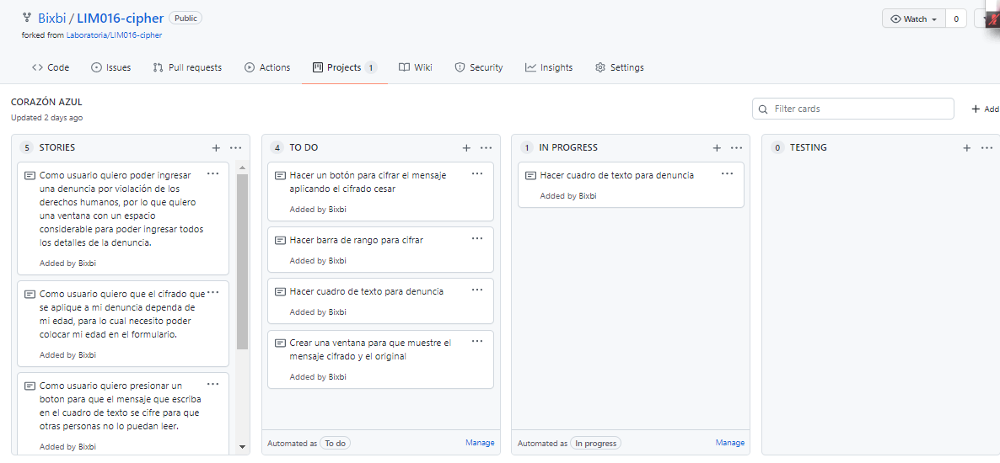
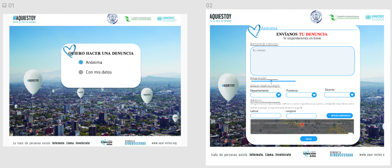
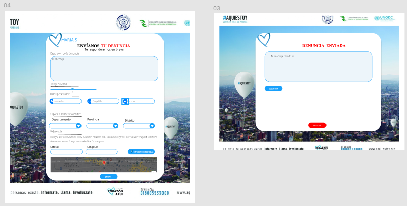
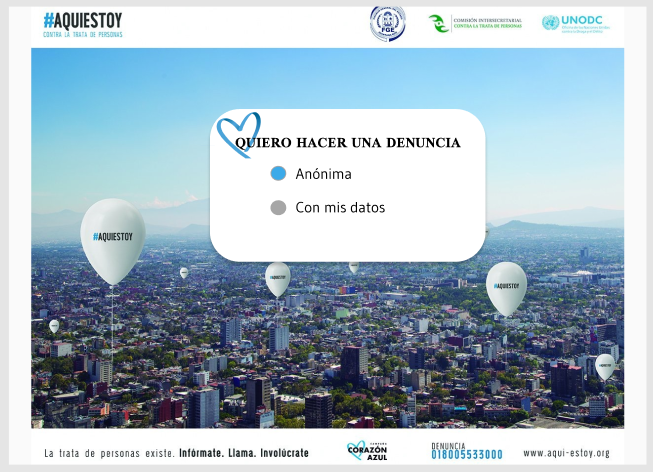
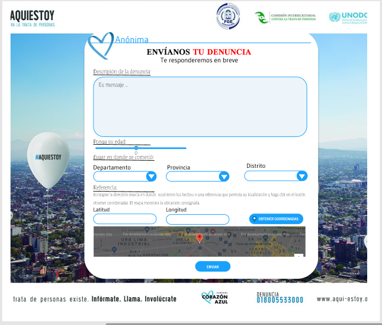
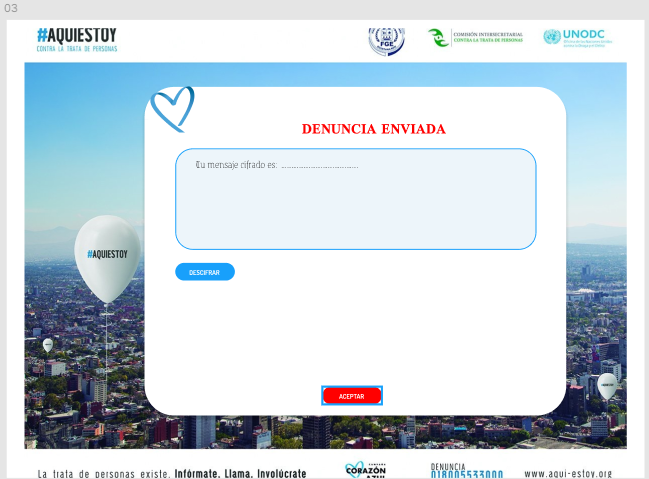
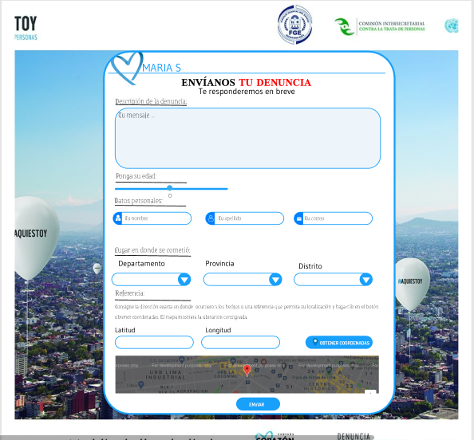

# CORAZÓN AZUL: Con Cifrado César

## Índice

* [1. Preámbulo](#1-preámbulo)
* [2. Resumen del proyecto](#2-resumen-del-proyecto)
* [3. Identificación del problema](#3-identificación-del-problema)
* [4. Investigación](#4-investigación)
* [5. Planificación](#5-criterios-de-aceptación-mínimos-del-proyecto)
* [6. Cómo utilizar el producto](#6-cómo-utilizar-el-producto)
* [7. Criterios de aceptación mínimos del proyecto](#8-criterios-de-aceptación-mínimos-del-proyecto)
* [8. Checklist](#9-checklist)

***

## 1. Preámbulo

Cifrar significa codificar. El [cifrado César](https://en.wikipedia.org/wiki/Caesar_cipher) es uno de los primeros métodos de cifrado conocidos históricamente. Julio César lo usó para enviar órdenes a sus generales en los campos de batalla. Consistía en escribir el mensaje con un alfabeto que estaba formado por las letras del alfabeto latino normal desplazadas tres posiciones a la derecha. 

Con nuestro alfabeto el sistema quedaría así:

* Alfabeto en claro: 	A B C D E F G H I J K L M N Ñ O P Q R S T U V W X Y Z
* Alfabeto cifrado:   D E F G H I J K L M N Ñ O P Q R S T U V W X Y Z A B C

Por ejemplo, si usamos un desplazamiento (_offset_) de 3 posiciones:

* La letra A se cifra como D.
* La palabra CASA se cifra como FDVD.
* Alfabeto sin cifrar: A B C D E F G H I J K L M N O P Q R S T U V W X Y Z
* Alfabeto cifrado: D E F G H I J K L M N O P Q R S T U V W X Y Z A B C

El receptor del mensaje conocía la clave secreta de éste (es decir, que estaba escrito con un alfabeto desplazado tres posiciones a la derecha), y podía descifrarlo fácilmente haciendo el desplazamiento inverso con cada letra del mensaje. Pero para el resto de la gente que pudiese accidentalmente llegar a ver el mensaje, el texto carecía de ningún sentido.

## 2. Resumen del proyecto

En este proyecto se crea una aplicación web para ingresar denuncias por violación de los
derechos humanos aplicando el cifrado cesar sobre los datos personales y la denuncia ingresada tomando en cuenta la edad(_offset_) del informante para el desplazamiento específico de los caracteres.

## 3. Identificación del problema
El presente proyecto tiene como punto de partidad una problematica muy preocupante en nuestra sociedad que es la "TRATA DE PERSONAS".
La trata de personas es una forma de esclavitud moderna que vulnera los derechos humanos, comprende la captación, transporte, traslado, acogida o la recepción de personas, recurriendo a la amenaza, uso de fuerza, engaño u otras formas de coacción, como rapto, fraude, engaño, abuso de poder o de una situación de vulnerabilidad con fines de explotación . Es considerado el delito más lucrativo después de tráfico de armas y la comercialización de drogas.

Frente a ello el Ministerio de la Mujer y Poblaciones Vulnerables se une a la campaña "CORAZÓN AZUL" que es una iniciativa de sensibilización para luchar contra la trata de personas y su impacto en la sociedad.
Con la Campaña Corazón Azul se trata de alentar una participación masiva y servir de inspiración a medidas que contribuyan a poner fin a este delito.
La Campaña permite también que personas expresen su solidaridad con las víctimas de la trata de personas, luciendo para ello un Corazón Azul.

#### ¿Y el Corazón Azul?
El Corazón Azul representa la tristeza de quienes son víctimas de la trata de personas y nos recuerda la insensibilidad de quienes compran y venden a otros seres humanos. El uso del color azul de las Naciones Unidas también demuestra el compromiso de la Organización con la lucha contra ese delito que atenta contra la dignidad humana, frente a ello se identifica el principal problema que es la falta de una plataforma que reciba denuncias por violación de los derechos humanos y estas denuncias representen seguridad para el informante.

*  (CONTEXTO) : Muchas personas no denuncian un caso de violación de los derechos humanos por temor a que sus datos y denuncias sean identificados y captados en la web, y temen por su seguridad.

*  (PROBLEMA) : Mantener las denuncias de los informantes sin cifrado en la web representa un riesgo enorme para la seguridad de quienes denuncian.

*  (IMPORTANCIA) : Tener una plataforma web que mantiene los datos seguros y cifrados aumenta la cantidad de personas que dununcien un caso de violación de los derechos humanos.

#### Referencias de Investigación 

- [Ministerio de la Mujer y Poblaciones Vulnerables](https://www.mimp.gob.pe/direcciones/dgcvg/contenidos/articulos.php?codigo=51 )

- [Observatorio Nacional](https://observatorioviolencia.pe/tag/corazon-azul/)

- [United Nations Office on Drugs and Crime](https://www.unodc.org/blueheart/es/about-us.html)

- [Corazón Azul](http://www.corazon-azul.org/)

- [INEI](https://www.inei.gob.pe/media/MenuRecursivo/boletines/boletin_trata_de_personas_4.pdf)

## 4. Investigación
Tomando en consideración que para el desarrollo de la plataforma web de denuncias es necesario implementar un método de cifrado cesar, para lo cual se hizo la busqueda correspondiente y los puntos de partida fueron:

- Definir e identificar la fórmula del cifrado cesar.
- Identificar la cantidad de caracterez que se tiene que avanzar para el cifrado según la variable offset.
- Probar con una letra en mayuscula y luego una palabra.
- Probar con una letra en minuscula y luego una palabra.
- Evaluar el uso de la letra "ñ", "Ñ" y los numeros.
- Evaluar el uso de espacios y caracteres.
- Retornar el mensaje cifrado y una opción de decifrar.

Teniendo en cuenta los items mencionados se realizo la investigación correspondiente, implementando cada uno de ellos en la plataforma web de denuncias.

## 5. Planificación 
* La planificación se realizó en Github Project .[Github Project].(https://github.com/Bixbi/LIM016-cipher/projects/1), manejando dos sprint en el plazo de dos semanas.

* Prototipo desarrollado en .[Figma].(https://www.figma.com/file/5wNZDmpoNrKYwbCGBLAQzV/Coraz%C3%B3n-Azul-team-library?node-id=0%3A1), para el desarrollo del prototipo se creó una pantalla de inicio donde el denunciante decide si quiere ingresar una denuncia anónima o con datos personales, si el denunciante quiere ingresar una denuncia anónima se le mostrará un formulario solo con casillar generales habilitadas como el lugar del incidente, ubicación, casilla donde ingresara la denuncia y su edad, caso contrario le aparecerá adicional las casillas de nombre, apellido y correo electrónico, tal como se aprecia en las siguientes imagenes:

#### ¿ Quiénes son nuestros usuarios?
Los usuarios del producto son todas las personas que pueden hacer uso de una computadora y deseen ingresar una denuncia por violacion de los derechos humanos, con total seguridad : Niños/as, adultos, ancianos.

#### Definición del producto
El objetivo del producto es brindar una plataforma segura para el registro de los datos y la denuncia del informante aplicando un metodo de cifrado sobre los datos ingresados para proteger la información del denunciante, se trabaja en coordinación con el Ministerio de la Mujer y Poblaciones Vulnerables, la United Nations Office on Drugs and Crime y apoyando la campaña denominada "CORAZÓN AZUL", brindando una plataforma segura y al alcance de todas las personas que quieran denunciar un caso de violación de los derechos humanos.

#### Proceso

- Prototipado (sketching)

Para el diseño del prototipo se considero colores sobrios (azul, celeste, blanco) y un diseño simple y de facil llenado para no dificultar el registro de la denuncia, captando datos esenciales en el registro.

## 6. Cómo utilizar el producto

### Introducción

Aplicación web muy intuitiva y facil de usar, que tiene el objetivo principal de captar todas las denuncias por violación de los derechos humanos, los usuarios se sentiran comodos y seguros para registar sus denuncias debido a que se aplica el metodo de cifrado cesar sobre los datos ingresados, para resguardar la información del denunciante. 

 ### Su funcionalidad
La funcionalidad de la pagina web es exclusivamente para registrar todas las denuncias por violación de los derechos humanos, mostrando un formulario de muy facil llenado.

### Interfaz de usuario (UI)

La interfaz permite al usuario:

* Determinar si desea ingresar la denuncia de forma anónima o con su datos.
* Si este seleccionad la opción de ingresar la denuncia de forma anónima se le mostrara un formulario donde tendra un cuadro de texto donde ingrese la denuncia, tendra que poner su edad (offset - esta puede ser un valor positivo o negativo para dificultar el cifrado).
* Insertar un mensaje (denuncia) que queremos cifrar.
* Ver el resultado de la denuncia cifrada.
* El misma denuncia cifrada la vuelve a descifrar.
* Ver el resultado de la denuncia descifrada.

  

Links Relacionados

  * [Historias de usuario](https://github.com/Bixbi/LIM016-cipher/projects/1)
  * [Pagina web corazon azul](https://github.com/Bixbi/LIM016-cipher/blob/main/src/index.html)

## 7. Criterios de aceptación mínimos del proyecto

Usa este alfabeto simple (solamente mayúsculas y sin ñ):

* A B C D E F G H I J K L M N O P Q R S T U V W X Y Z

## 8. Checklist

### Parte Obligatoria

* [ x ] `README.md` incluye info sobre proceso y decisiones de diseño.
* [ x ] `README.md` explica claramente quiénes son los usuarios y su relación con
  el producto.
* [ x ] `README.md` explica claramente cómo el producto soluciona los
  problemas/necesidades de los usuarios.
* [ x ] Usa VanillaJS.
* [ x ] Implementa `cipher.encode`.
* [ x ] Implementa `cipher.decode`.
* [ ] Pasa linter con configuración provista.
* [ ] Pasa pruebas unitarias.
* [ ] Pruebas unitarias cubren 70% de _statements_, _functions_ y _lines_, y un
  mínimo del 50% de _branches_.
* [ x ] Interfaz permite elegir el `offset` o _desplazamiento_ a usar en el
  cifrado/descifrado.
* [ x ] Interfaz permite escribir un texto para ser cifrado.
* [ x ] Interfaz muestra el resultado del cifrado correctamente.
* [ x ] Interfaz permite escribir un texto para ser descifrado.
* [ x ] Interfaz muestra el resultado del descifrado correctamente.

### Parte Opcional: "Hacker edition"

* [ x ] Cifra/descifra minúsculas
* [ x ] Cifra/descifra _otros_ caracteres (espacios, puntuación, `ñ`, `á`, ...)
* [ ] Permite usar un `offset` negativo.
